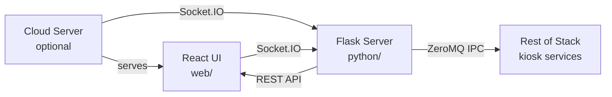

# Control Panel

React UI and Python Socket.IO backend for kiosk control and status, with ZeroMQ IPC to the rest of the stack.

## Architecture



## Deployment modes

The same build can be used on-device or from the cloud. The connection target is set via the **title bar text field** in the UI (e.g. type `ns1136` and press Enter). Short names are resolved to `{name}.keymekiosk.com`, port 2026. There are no URL params for host, device, or port.

- **On device:** Open e.g. `http://ns1136.keymekiosk.com:2026/`. The title bar defaults to the current hostname (e.g. `ns1136`). Socket.IO and API use the same origin.
- **From cloud:** Open the cloud URL; type the device short name (e.g. `ns1136`) in the title bar and press Enter. Socket.IO and API both use `http://ns1136.keymekiosk.com:2026`.

Socket URL and API base are derived in `web/src/lib/socketUrl.js`: `buildBaseUrl(deviceHost)` and `getInitialDeviceHost()` for the initial value. The title bar drives the active device.

## Running

**Device (production):** Started by the manager as `control_panel/python/main.py`. Listens on the port in `config/ports.json` (`python`, default 2026). Ensure the web app is built:

```bash
cd control_panel/web && npm run build
```

**Web dev:** From repo root (or `control_panel/web`):

```bash
cd control_panel/web && npm run dev
```

Vite runs on port 8081 and proxies `/socket.io` to the Python port (2026). Run the Python server separately (e.g. `control_panel/python/main.py`) so the socket connects.

**Dev mode:** Use the title bar device field to connect. For device-like behavior use `http://localhost:8081/` (default host is localhost; socket goes through the Vite proxy to 2026). To simulate another device, type its host in the title bar (e.g. `ns1136`) and press Enter.

## Config

- **`config/ports.json`:** `python` — port for the Flask/Socket.IO server (2026); `react` — Vite dev server port (8081).
- **`config/control_panel.json`:** Optional; e.g. `max_decode_packets` for Engine.IO.

## REST API (planned)

Device and cloud will share the same REST API code (`control_panel/api/` Flask blueprints). The device server will register the API with a device backend (IPC/local state); a future cloud server will serve the same UI and API with a cloud backend. The frontend uses the current page origin for REST API; only Socket.IO uses the title-bar device host (e.g. ns1136).
