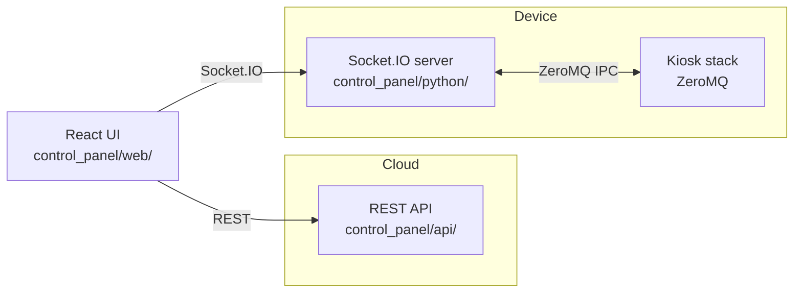

# Control Panel

React UI with a Python backend: **Socket.IO runs on the device** (kiosk control and status, ZeroMQ IPC to the rest of the stack); **REST API runs on the cloud**.

## Architecture

**Split:** The UI is served from the cloud. It calls the **cloud** for REST (config, reports, calibration data) and the **device** for real-time control and status over Socket.IO. The device server bridges Socket.IO to the rest of the kiosk stack via ZeroMQ.

**High-level flow:**



**Components:**

| Layer | Location | Role |
|-------|----------|------|
| **React UI** | `web/` | Single-page app; served by cloud. Uses REST for data, Socket.IO for live status and control. |
| **REST API** | `api/` (cloud) | Flask blueprints — calibration, testcuts, reports, wellness, etc. Stateless; backed by cloud storage. |
| **Socket.IO server** | `python/` (device) | Flask + Socket.IO. Real-time events, panel status, terminals. Proxies commands to kiosk via ZeroMQ. |
| **Kiosk stack** | (other services) | Hardware and services on device; communicate with control panel over ZeroMQ. |

## Running (device)

The device runs the Socket.IO server. Started by the manager as `control_panel/python/main.py`. Listens on the port in `config/ports.json` (`python`, default 2026). Build the web app first:

```bash
cd control_panel/web && npm run build
```

**Web dev:** From repo root or `control_panel/web`:

```bash
cd control_panel/web && npm run dev
```

Vite runs on port 8081 and proxies `/socket.io` to the Python port (2026). Run the Python server separately (`control_panel/python/main.py`) so the socket connects.

## Config

- **`config/ports.json`:** `python` — Flask/Socket.IO server port (2026); `react` — Vite dev server port (8081).
- **`config/control_panel.json`:** Optional, e.g. `max_decode_packets` for Engine.IO.

## REST API

REST API is hosted on the cloud (`control_panel/api/` Flask blueprints). The device server provides Socket.IO only; the cloud serves the UI and the REST API.
