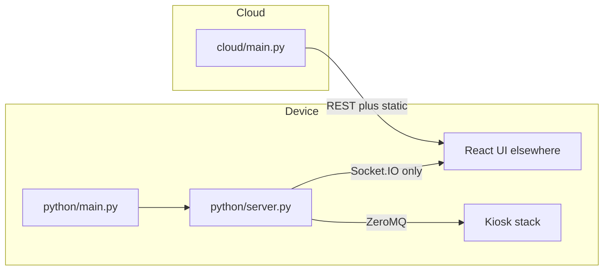

# Control Panel

React UI with a Python backend: **Socket.IO runs on the device** (kiosk control and status, ZeroMQ IPC to the rest of the stack); **REST API runs on the cloud**.

## Architecture

**Split:** The UI is served from the cloud. It calls the **cloud** for REST (config, reports, calibration data) and the **device** for real-time control and status over Socket.IO. The device server does not run REST or serve JS; the cloud does not run Socket.IO.

**Target architecture:**



- **Device:** `python/main.py` starts `python/server.py` — Socket.IO only; no REST API, no static/JS serving. Bridges to the kiosk stack via ZeroMQ.
- **Cloud:** `cloud/main.py` — FastAPI app with REST API router and serves the React build (`cloud/web/dist`); no Socket.IO. Only the cloud subtree is a uv project; device (`python/`) is unchanged.

**Components:**

| Layer | Location | Role |
|-------|----------|------|
| **React UI** | `cloud/web/` | Single-page app; built and served by cloud. Uses REST for data, Socket.IO (to device) for live status and control. |
| **REST API + static** | `cloud/` — entrypoint `cloud/main.py` | FastAPI app; uv project in `cloud/` only. API routes for calibration, testcuts, reports, etc.; serves `cloud/web/dist`. Stateless; cloud-only. |
| **Socket.IO server** | `python/` — entrypoint `python/main.py` (device) | Flask + Socket.IO only. Real-time events, panel status, terminals, IPC. Proxies commands to kiosk via ZeroMQ. No REST, no JS. |
| **Kiosk stack** | (other services) | Hardware and services on device; communicate with control panel over ZeroMQ. |

## Running (device)

The device runs the Socket.IO server. Started by the manager as `control_panel/python/main.py`. Listens on the port in `config/ports.json` (`python`, default 2026). Build the web app first (see **Running (cloud)** for where the build is used).

**Web dev:** From repo root or `control_panel/cloud/web`:

```bash
cd control_panel/cloud/web && npm run dev
```

Vite runs on port 8081 and proxies `/socket.io` to the Python port (2026). Run the Python server separately (`control_panel/python/main.py`) so the socket connects.

## Running (cloud)

The cloud is a FastAPI app managed with uv. It runs the REST API and serves the React build via `control_panel/cloud/main.py`. No Socket.IO. The web app lives under `cloud/web/`.

1. Build the web app: `cd control_panel/cloud/web && npm run build`
2. From **repo root**, run the cloud app with uv (only `control_panel/cloud` is a uv project):

```bash
uv run --project control_panel/cloud uvicorn control_panel.cloud.main:app --host 0.0.0.0 --port 8080
```

Port can be overridden with the `PORT` env var (e.g. `PORT=9000` before the command). Static root is resolved from the `cloud/main.py` file location, so `cloud/web/dist` is found regardless of CWD.

**Env (optional):**

- **`PORT`** — Server port (default 8080).
- **`CONTROL_PANEL_STATIC_ROOT`** — Path to the React build (default: `cloud/web/dist` next to `main.py`). Set this if you deploy the static files elsewhere.

**Docker (build from control_panel dir):**

Build (includes JS build in image):

```bash
cd control_panel
docker build -f cloud/Dockerfile -t control-panel-cloud .
```

Run (port 8080):

```bash
docker run -p 8080:8080 control-panel-cloud
```

The app uses boto3 to access S3 (calibration data). Pass AWS credentials in one of these ways:

- **Environment variables** (good for CI or injected secrets):

```bash
docker run -p 8080:8080 \
  -e AWS_ACCESS_KEY_ID=... \
  -e AWS_SECRET_ACCESS_KEY=... \
  -e AWS_DEFAULT_REGION=us-east-1 \
  control-panel-cloud
```

- **Mount local AWS config** (reuse `~/.aws` from the host):

```bash
docker run -p 8080:8080 \
  -v ~/.aws:/home/appuser/.aws:ro \
  -e HOME=/home/appuser \
  control-panel-cloud
```

(Use `-u $(id -u):$(id -g)` and a writable dir if the container user cannot read your `~/.aws`; or create a dedicated credentials file and mount that.)

- **IAM roles:** On ECS (task role), EKS (pod IRSA), or EC2 (instance profile), boto3 uses the role automatically; no env or mount needed.

## Testing (cloud API)

The cloud API has a pytest suite under `cloud/api/tests/`. Tests use [moto](https://github.com/getmoto/moto) to mock S3 so no AWS credentials are needed.

Install test dependencies and run from the **repo root**:

```bash
uv sync --project control_panel/cloud --extra test
uv run --project control_panel/cloud pytest control_panel/cloud/api/tests/ -v
```

## Config

- **`config/ports.json`:** `python` — Flask/Socket.IO server port (2026). (Vite dev server uses port 8081, set in `cloud/web/vite.config.js`.)
- **`config/control_panel.json`:** Optional, e.g. `max_decode_packets` for Engine.IO.

## REST API and cloud

REST API and JS serving run on the cloud via `control_panel/cloud/main.py` (FastAPI app; routes in `cloud/api/`). The device server (`python/main.py`) is unchanged and provides Socket.IO only. Cloud dependencies are managed with uv (`control_panel/cloud/pyproject.toml`). See **Running (cloud)** for how to start and configure the cloud server.
